+++
date = '2026-07-28T13:18:29+08:00'
draft = false
title = '如何利用Github Pages和hugo建立自己的博客'
tags = ['hugo', 'github-pages', '博客搭建', '教程']
comments = true

+++

## 使用Hugo + Github Pages建立个人博客


注意：搭建时环境为windows 11

## 1.下载git

这是windows下载地址https://git-scm.com/install/windows

## 2.注册Github账号

略

## 3. 下载Hugo

https://github.com/gohugoio/hugo/releases/tag/v0.164.0

下载完成后，将对应exe文件放在你自己设定的文件夹，设置环境变量

```
hugo version
```

有输出版本号，即为配置成功

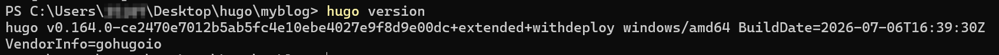

## 4.快速建立博客框架

首先选择你要访问博客项目的文件夹

在那个文件夹打开cmd

依次输入

```ini
# 在目录中为您的博客创建一个以myblog命名的文件夹目录结构
hugo new site myblog

# 将当前目录更改为博客的根目录
cd myblog

# 在当前目录中初始化一个空的 Git 存储库
git init

# 将PaperMod主题克隆到博客目录结构中，并将其作为Git子模块themes添加到您的博客中
git submodule add --depth=1 https://github.com/adityatelange/hugo-PaperMod.git themes/PaperMod

# 在博客配置文件hugo.toml(位于根目录)中添加一行，表明为PaperMod主题
echo 'theme = 'PaperMod' >> hugo.toml

# 启动Hugo的开发服务器来预览博客
hugo server
```

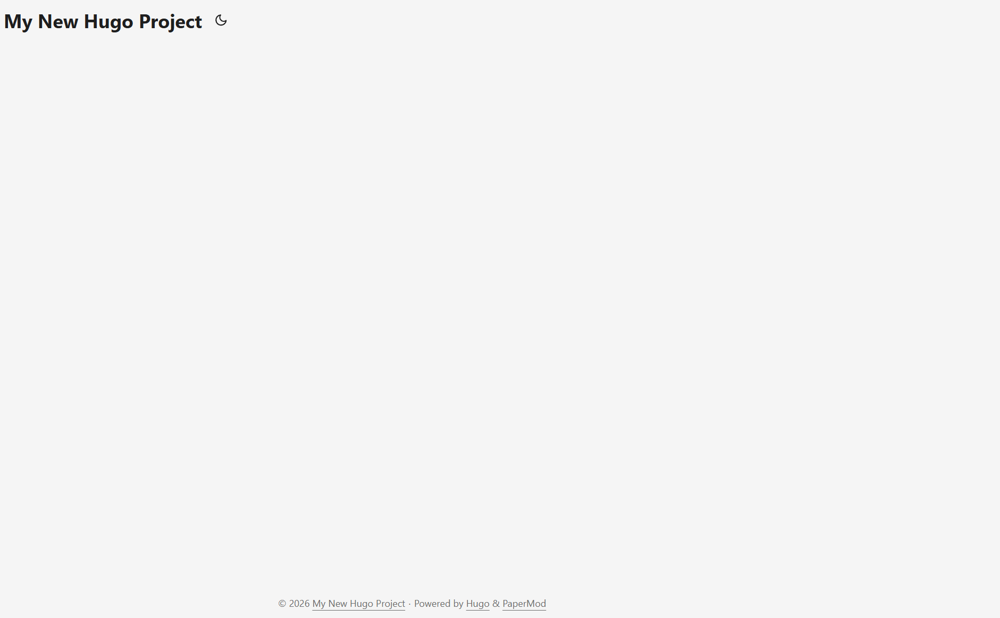


## 5.向网站添加新页面

```
# posts为你文章存储的文件夹名，可任取
# 默认生成路径在content文件夹下
#主要md文件必须以index命名
hugo new posts/文章标题/index.md
```

用编辑器打开创建的index.md可以看到其默认内容

```
date = '2026-07-28T01:21:07+08:00'
draft = true
title = 'Hello_world'
```

这里draft为true，代表处于草稿状态

将文件进行保存后，可通过

```
hugo server -D
```

来查看草稿文件

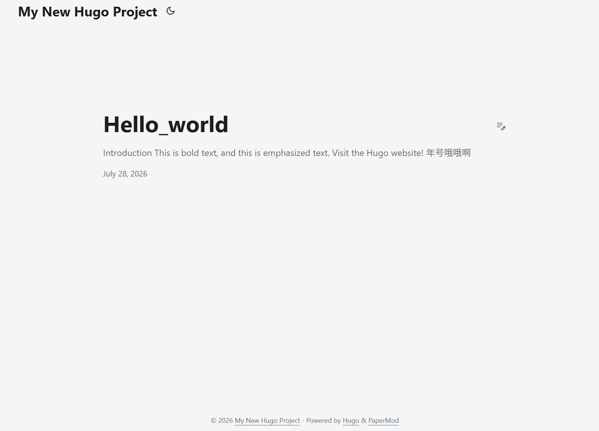


## 6.发布网站

这里是指将我们编写的文件内容转换成对应的html文件，其会存在public文件夹中，发布网站时，通常不希望包含草稿，所以只需要cmd中输入

```
hugo
```


## 7.在互联网上利用github部署个人博客

GitHub 通过 GitHub Pages 服务直接从 GitHub 存储库通过 SSL 为个人、组织或项目页面提供免费、快速的静态托管，并自动化开发工作流程并使用 GitHub Actions 进行构建

### step1.创建Github存储库

注意库名必须以用户名开头，例如：我的用户名是liumy-lay，则库名为liumy-lay.github.io

### Step2.将本地存储库推送到github

```
# 1. 将本地git库与远程Github库建立联系
git remote add origin git@github.com:你的github用户名/你的github用户名.github.io.git

# 2. 将当前目录下所有文件添加到暂存区
git add .

# 3. 提交代码并添加备注信息
git commit -m 'first commit' 

# 4. 推送到远程仓库（强烈建议加上 -u 参数）
git push origin main
```

这里需要注意几个点

这里在执行命令时所处的位置就是博客项目的根目录

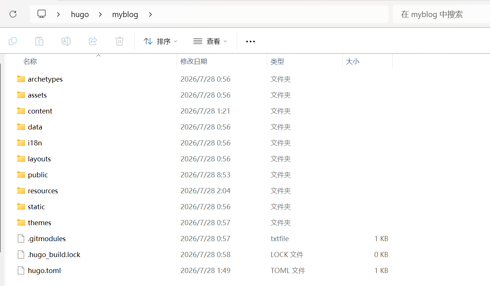

在git commit时，

```
# 需要先设置你自己的邮箱
git config --global user.email "你自己的邮箱"

# 需要先设置你自己的姓名
git config --global user.name "你自定义的姓名"
```

如果没有设置，就会出现

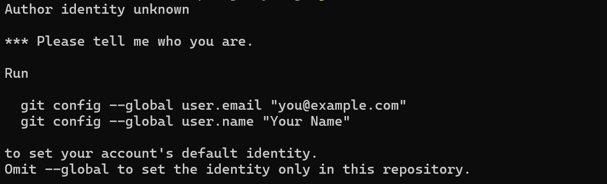

然后在git push的时候可能会出现

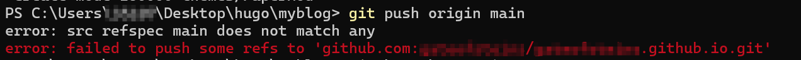

这是由于生成本地git库的分支默认是**master**,而github库的默认分支是**main**,因此git push时会出现各种错误

解决：将本地分支改名为main,

```
# 将当前分支改名为main
git branch -M main

# 查看当前所有分支
git branch -a
```

重新git push,这时可能遇到认证问题

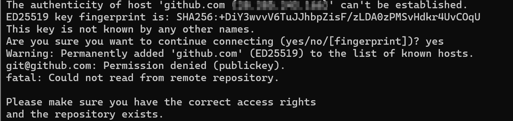

这里需要我们在本地生成ssh密钥，并在github上进行配置

打开powershell,输入

```
# 生成ssh密钥
ssh-keygen -t ed25519 -C "your_email@example.com"
```

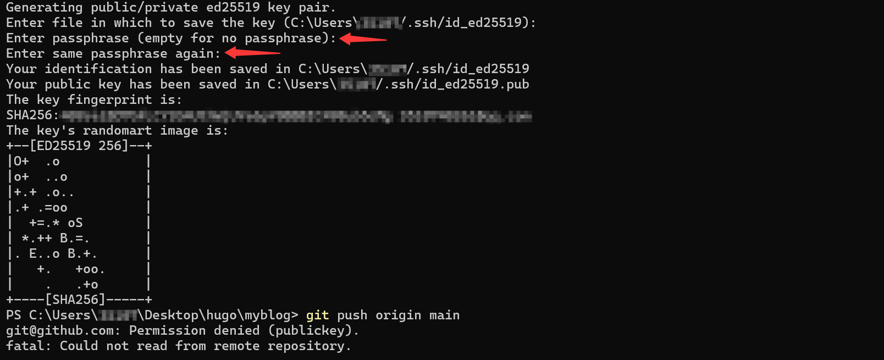

遇到两个箭头的地方直接enter，这样在你登录用户的家目录的.ssh文件夹中就会生成公钥和私钥

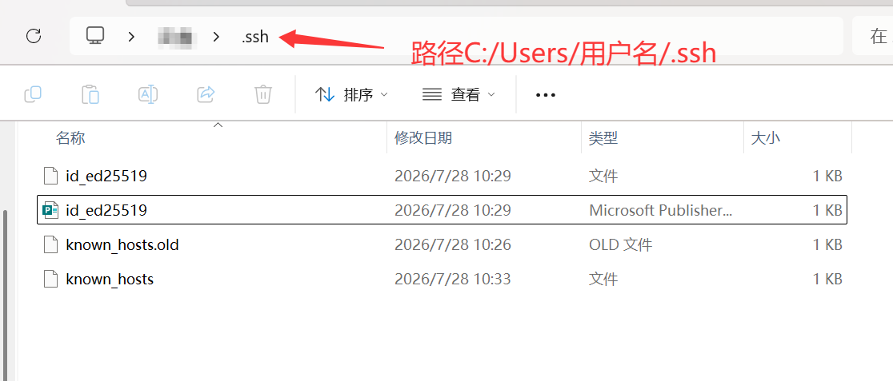

之后我们提取公钥内容，在powershell中输入

```
 # 查看生成公钥内容
 Get-Content ~/.ssh/id_ed25519.pub
```

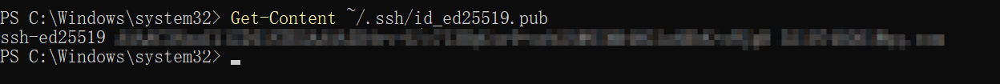


接着需要将这个内容填入github 的ssh key中

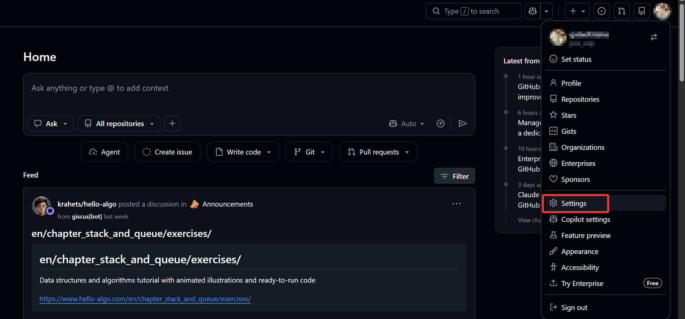

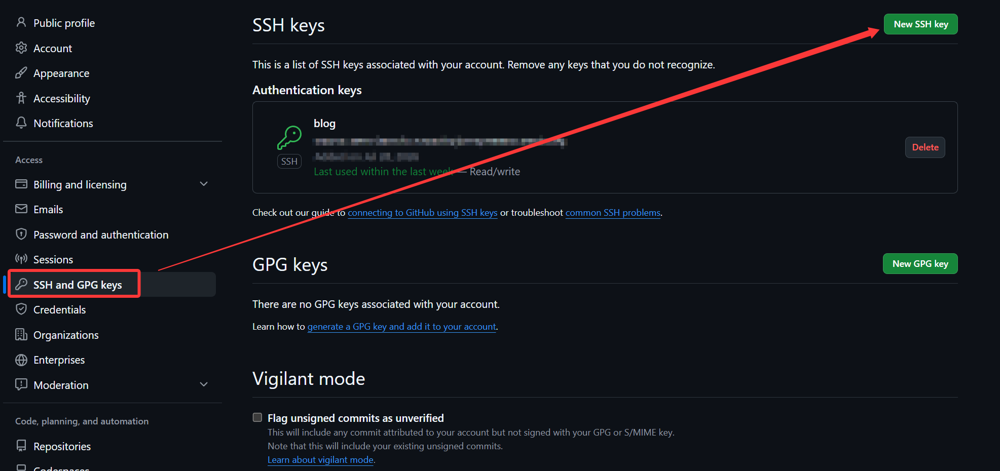

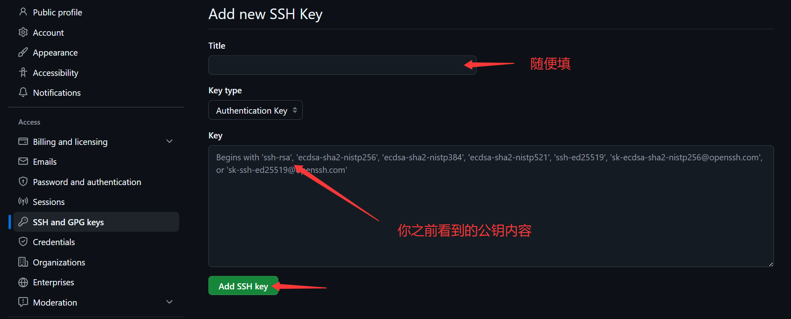

记住填入的公钥内容是 Get-Content ~/.ssh/id_ed25519.pub看到的所有，不要遗漏

之后再将暂存区内容push到远程仓库的main分支

```
git push origin main
```

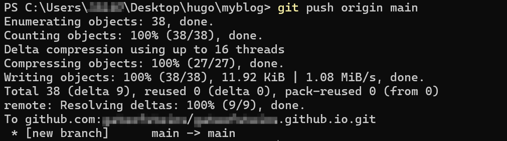

这样我们就可以在github仓库中看到对应的文件

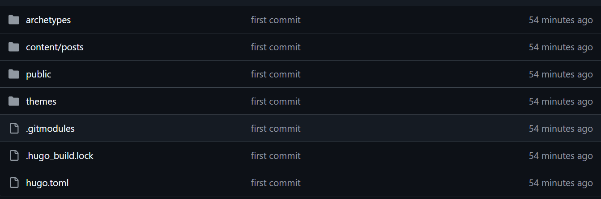


### step3.访问您的 GitHub 存储库，从主菜单中选择设置 > 页面

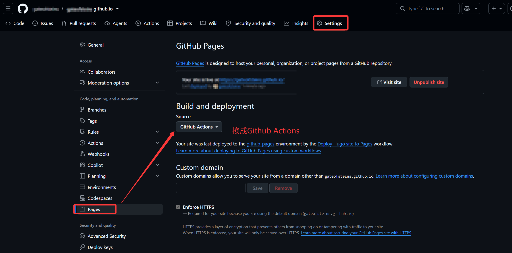

注意是先在github上进入你的仓库，点击它的setttings


### step4.在本地存储库中根目录下创建一个文件，.github/workflows/hugo.yaml

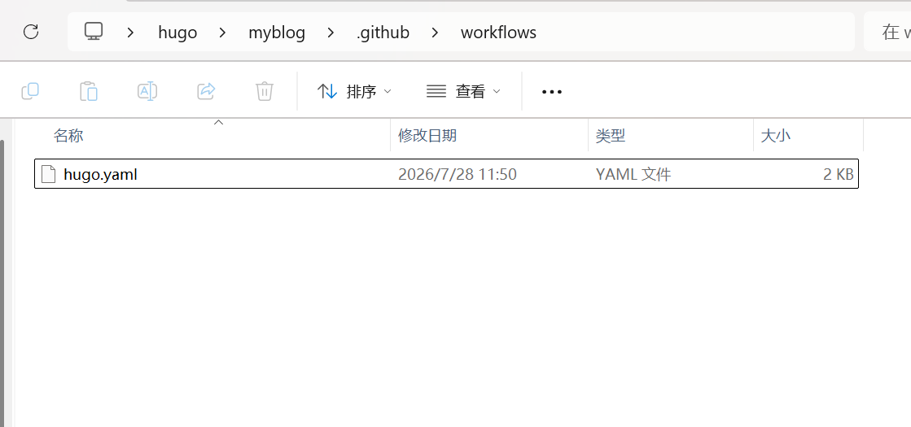

文件具体内容需要根据你自己的hugo版本进行修改，里面我标注一下我遇到的可能出现错误的几个点

```python
# Sample workflow for building and deploying a Hugo site to GitHub Pages
name: Deploy Hugo site to Pages

on:
  push:
    branches:
      - main   # 这里我们修改为main
  workflow_dispatch:

permissions:
  contents: read
  pages: write
  id-token: write

concurrency:
  group: "pages"
  cancel-in-progress: false

defaults:
  run:
    shell: bash

jobs:
  build:
    runs-on: ubuntu-latest
    env:
      HUGO_VERSION: 0.164.0   # 这里需要看一下你自己的hugo版本
    steps:
      - name: Install Hugo CLI
        run: |
          wget -O ${{ runner.temp }}/hugo.deb https://github.com/gohugoio/hugo/releases/download/v${HUGO_VERSION}/hugo_extended_${HUGO_VERSION}_linux-amd64.deb \
          && sudo dpkg -i ${{ runner.temp }}/hugo.deb
          
      - name: Install Dart Sass
        run: sudo snap install dart-sass
        
      - name: Checkout
        uses: actions/checkout@v4
        with:
          submodules: recursive
          fetch-depth: 0
          
      - name: Setup Pages
        id: pages
        uses: actions/configure-pages@v5
        
      - name: Install Node.js dependencies
        run: "[[ -f package-lock.json || -f npm-shrinkwrap.json ]] && npm ci || true"
        
      - name: Build with Hugo
        env:
          HUGO_ENVIRONMENT: production
          HUGO_ENV: production
        run: |
          hugo \
            --gc \
            --minify \
            --baseURL "${{ steps.pages.outputs.base_url }}/"
            
      - name: Upload artifact   # 这里需要执行这个参数，因为hugo有点不一样，需要指定去./public找页面
        uses: actions/upload-pages-artifact@v3
        with:
          path: ./public  # 核心修复：明确指定 Hugo 的默认输出目录，防止找不到 _site/ 报错

  deploy:
    environment:
      name: github-pages
      url: ${{ steps.deployment.outputs.page_url }}
    runs-on: ubuntu-latest
    needs: build
    steps:
      - name: Deploy to GitHub Pages
        id: deployment
        uses: actions/deploy-pages@v4
```

### step5.使用“Add workflows”之类的提交消息将更改提交到本地存储库，然后推送到 GitHub

在本地添加了文件夹和文件后，到博客根目录打开cmd

```
git add .
# 这里-m后是我们提交的附带信息
git commit -m "Add workflow"
git push origin main
```

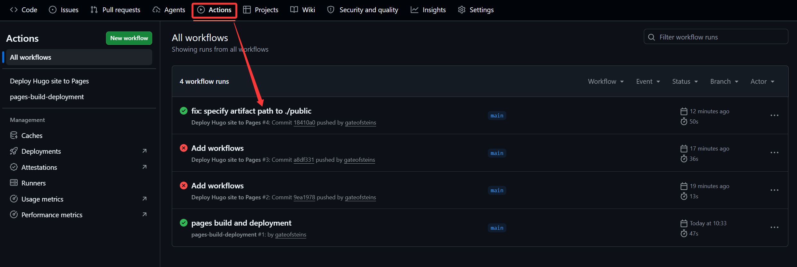

这里是我之前hugo文件内容有问题的几个提交，在这里我们可以看到我们的workflow是否添加成功

当 GitHub 完成站点的构建和部署后，状态指示器的颜色将变为绿色。在部署步骤下，您将看到指向您的实时站点的链接。

将来，每当从本地存储库推送更改时，GitHub 都会重建您的站点并部署更改

这样到之前的pages页面就可以看到我们博客的访问地址

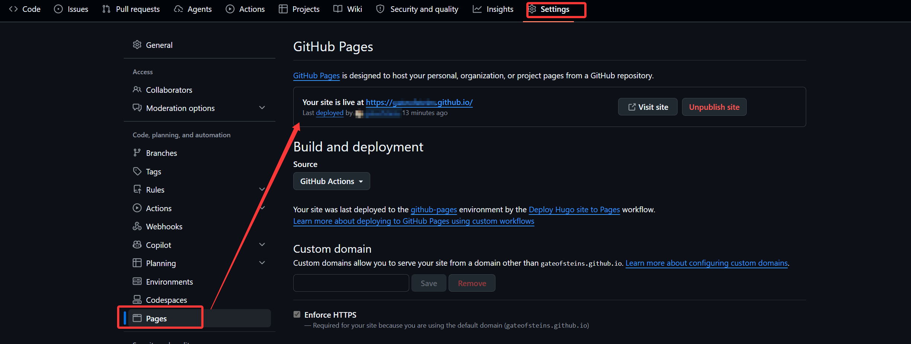

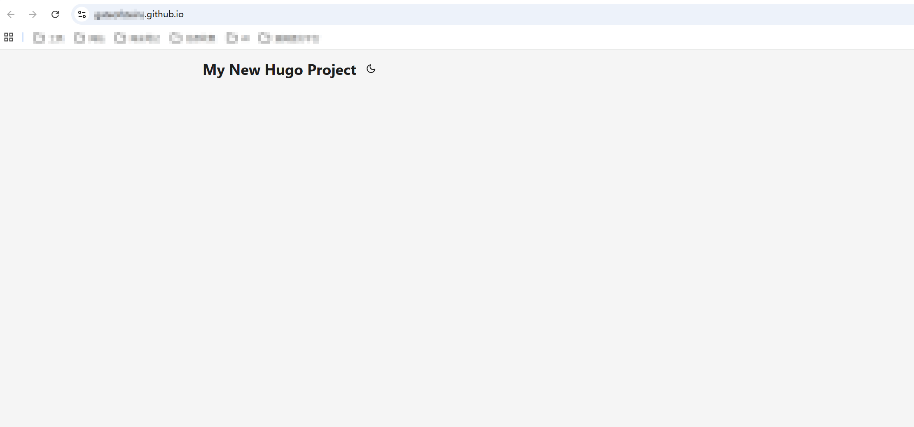


### step6. 撰写博客并发布

日常发布文章命令

```
hugo new posts/[name]/index.md
hugo server -D
hugo
git status
git add .
git commit -m '[描述信息]'
git push origin main
```


### 一些别的注意点

 	1. 不要随便修改md中默认生成的内容，你的文章标题是根据md默认内容中的title决定的
   	2. 图片资源等配置参考的是https://www.cnblogs.com/liumylay/articles/17936667.html，其中我选择typora作为md文件编辑器，下面是我的设置，可以避免上传后，图片找不到的问题

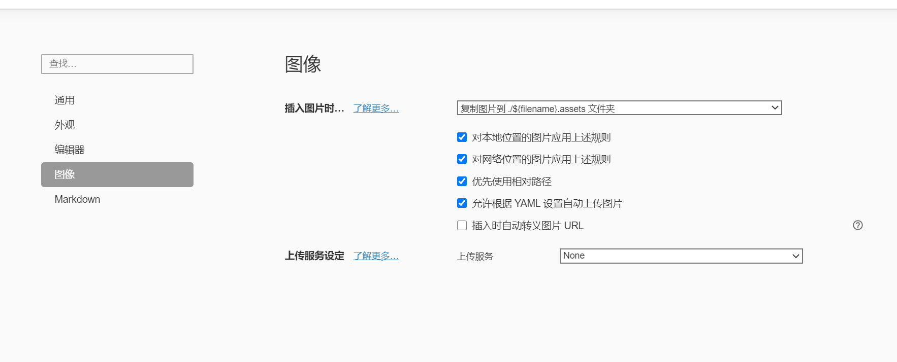